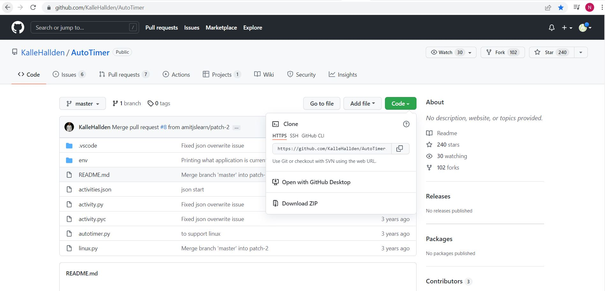

# **Digital and Soft Skills - Challenge**
## **Auto-daily report creator**
### Noureldeen Nagm 

 
<br>

-- --

### **Introduction**  

In my last job I was required to create a daily report showing my daily tasks and how long did I work on each task. As a person who have a terrible memory this has been a very time consuming and a frustrating task to do. 

Later when I was intruduced to GitHub and python repos overall I learned that coding is all about automating such tasks that are easy but takes alot of time.

In this repository I will explain to you how was I able to automatically track my computer activity and export it into an excell file using two repos I found.
<br>


-- --

### **Auto Timer**  

 

This repo is an automatic time tracking tool using python that display your computer activity in a json file.

[GitHub Link](https://github.com/KalleHallden/AutoTimer) 

[Youtube Tutorial](https://www.youtube.com/watch?v=ZBLYcvPl1MA)  
 

**Dependencies**  
- selenium.
- pywin32.
- python-dateutil.
- uiautomation.

**Clonning the repo**   

1.) Go to the GitHub link and clone the repo.

 

2.) Right click on your repos folder and choose git bash here.

3.) Use the command:

``` 
git clone
``` 
and paste the copied URL to clone the repo.


**Setting up anaconda environment** 

1.) Create a python 3.8 anaconda invironment an name it "Daily Report Creator".

 

2.) Install selenium by Opening the Terminal and typing the command:
```
pip install selenium
```
3.) Repeat the process for the other dependencies.

Or you can just install the dependencies using anaconda interface.

**Running the code** 

1.) In the terminal go to the folder directory and type the following command:

```
Python autotimer.py
```
2.) Start using your computer normally while the code is running in the background. 


**Output** 

1.) Check the terminal it should be writing the name of the softwares you are using or the name of the websites your are visiting. 

2.) Check the folder directory for a json file created containing all of your activities and their time interval.

**Cleaning the json file** 

As you can see the file contains alot of data that might be problematic for later steps. There for its important that we clean our file by removing the unneeded data and only leaving for each activity the line with the name and the line with the time in minutes.

As an example you can check the file I used after sorting by clicking this link: 

[activities.json](./core/activities.json)

<br>

-- --

**JSON to Excel** 

 

Now as we saw we are getting a raw json file that still needs to be sorted out. What we want to do is convert this output to an excel file and I found the perfect way to do so by using the "Convert JSON to Excel in Python 3 using json2excel Library" code.

[Code source](https://codingdiksha.com/convert-json-to-excel-python/) 

[Youtube Tutorial](https://www.youtube.com/watch?v=gop5KuQiE_o)  

**Dependencies**  
- json2excel library.

**Clonning the repo**   

Create a new python file using your favourite code editor software (for me its visual studio code) and copy the following code inside you can name that file "json_excel.py" :

``` 
from json2excel import Json2Excel

if __name__ == '__main__':
    json2excel = Json2Excel(head_name_cols=["rank", "name"])
    # print(json2excel.run('./test.json'))

    jsons = [
        {
            "student_no": 1001,
            "name": "James",
            "score": 10,
            "class": "A-1",
            "rank": 1
        },
        {
            "student_no": 1002,
            "name": "Tome",
            "score": 91,
            "class": "A-1",
            "rank": 2
        },
    ]
    print(json2excel.run(jsons))
``` 
Or you can just download the file from this link [json_excel.py](./core/json_excel.py)  

Note that this code contains a random json data that later we would nead to replace with our auto timer json file output.

**Setting up anaconda environment** 

1.) Use the same environment we created earlier.

2.) Install json2excel library by Opening the Terminal and typing the command:
```
pip install json2excel library
```
Or you can just install it using anaconda interface.

**Running the code** 

1.) In the terminal go to the folder directory and type the following command:

```
Python json_excel.py
```
2.) Open the json file named activities.json and copy the text inside.

3.) Open the json_excel.py file and paste the content.

4.) Look for this line 
```
json2excel = Json2Excel(head_name_cols=["rank", "name"])
```
and delete the world rank from brackets.

4.) Go to the file path in the terminal using your web browser or file explorer.

**Output** 

The output should be an excel file contatining the name of your activities and the time each activity took in minutes.

As an example you can check the file I was able to create by following the past steps by clicking this link: 

[daily_report.xlsx](./core/daily_report.xlsx)


<br>

-- --
contact information: noureldeen.nagm@rwth-aachen.de - Noureldeen Nagm